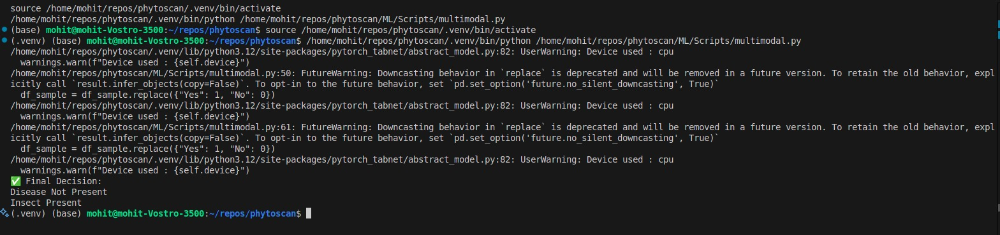

# 🌿 PhytoScan — A Multimodal Plant Health Diagnostic System

## 📝 Index

- [🌿 PhytoScan — A Multimodal Plant Health Diagnostic System](#-phytoscan--a-multimodal-plant-health-diagnostic-system)
    - [Round-1 Hackathon Submission](#round-1-hackathon-submission)
  - [📝 Index](#-index)
  - [1. CVAT (Offline) Setup Procedure](#1-cvat-offline-setup-procedure)
    - [⚙️ System Configuration](#️-system-configuration)
    - [📦 Installation Steps](#-installation-steps)
  - [2. Annotation Techniques Used](#2-annotation-techniques-used)
    - [📁 Datasets](#-datasets)
    - [🧠 Annotation Process](#-annotation-process)
    - [🧪 Classes](#-classes)
  - [3. Annotated Dataset Download Links](#3-annotated-dataset-download-links)
  - [4. Architecture of the Multimodal System](#4-architecture-of-the-multimodal-system)
    - [🧩 Overview](#-overview)
    - [📊 Final Output Decision Logic](#-final-output-decision-logic)
    - [🖼️ Architecture Diagram](#️-architecture-diagram)
  - [5. Implementation Code](#5-implementation-code)
  - [6. Running the Application End-to-End](#6-running-the-application-end-to-end)
  - [7. Output Screenshots \& Evaluation Metrics](#7-output-screenshots--evaluation-metrics)
    - [📈 YOLOv8s-seg (Crop Disease Segmentation)](#-yolov8s-seg-crop-disease-segmentation)
    - [📈 YOLOv8s (Crop Insect Detection)](#-yolov8s-crop-insect-detection)
    - [🧠 TabNet - Crop Disease (Text Input)](#-tabnet---crop-disease-text-input)
    - [🐛 TabNet - Crop Insect (Text Input)](#-tabnet---crop-insect-text-input)
  - [8. Conclusion](#8-conclusion)

---

## 1. CVAT (Offline) Setup Procedure

We used **CVAT (Computer Vision Annotation Tool) in Offline Mode** for all image annotation tasks. The goal was to annotate two datasets: one for **crop diseases (segmentation)** and another for **crop insects (bounding boxes)**.

### ⚙️ System Configuration

* Virtualization: **Docker Desktop**
* GPU: Colab (used only for training, not local)

### 📦 Installation Steps

1. **Install Docker Desktop**
   Download from: [https://www.docker.com/products/docker-desktop](https://www.docker.com/products/docker-desktop)

2. **Clone CVAT Repository**

   ```bash
   git clone https://github.com/openvinotoolkit/cvat.git
   cd cvat
   ```

3. **Launch CVAT Offline**

   ```bash
   docker compose -f docker-compose.yml -f docker-compose.dev.yml up -d
   ```

4. **Access CVAT**
   Open `http://localhost:8080` in your browser.
   Default login: `admin / admin`

5. **Create Tasks and Upload Images**
   For both crop disease and insect datasets, separate tasks were created.

6. **Annotation Formats Exported:**

   * **Crop Disease (Segmentation):** `Ultralytics YOLO Segmentation 1.0`
   * **Crop Insect (Detection):** `Ultralytics YOLO Detection 1.0`

---

## 2. Annotation Techniques Used

### 📁 Datasets

1. **Crop Disease Dataset (50 images)**
   Used for pixel-level **semantic segmentation**.
   Exported as: `Ultralytics YOLO Segmentation 1.0`

2. **Crop Insect Dataset (50 images)**
   Used for bounding box **object detection**.
   Exported as: `Ultralytics YOLO Detection 1.0`

### 🧠 Annotation Process

| Step | Task         | Annotation Type | Tool |
| ---- | ------------ | --------------- | ---- |
| 1    | Crop Disease | Polygon Tool    | CVAT |
| 2    | Crop Insect  | Rectangle Tool  | CVAT |

Each image was manually annotated to ensure:

* **High label precision**
* **Minimal noise**
* **Consistent class mapping**

### 🧪 Classes

* Disease class: `disease`
* Insect class: `insect`

---

## 3. Annotated Dataset Download Links

* [🔗 Crop Disease Annotated Dataset (Google Drive)](https://drive.google.com/drive/folders/1S2R3ZaF5d2iSmSAVzE-byo8Xkaeel_1G?usp=sharing)
* [🔗 Crop Insect Annotated Dataset (Google Drive)](https://drive.google.com/drive/folders/1DLnJYGHeuzp_QaH2joYdvDAWyxmpIzLL?usp=sharing)

---

## 4. Architecture of the Multimodal System

### 🧩 Overview

PhytoScan integrates four different inputs through a modular and rule-based multimodal pipeline:

| Input                        | Model Used  | Output                         |
| ---------------------------- | ----------- | ------------------------------ |
| 1. Image (Crop Disease)      | YOLOv8s-seg | Presence of Disease (Output-1) |
| 2. Image (Crop Insect)       | YOLOv8s     | Presence of Insect (Output-2)  |
| 3. Text (Symptoms - Disease) | TabNet      | Presence of Disease (Output-3) |
| 4. Text (Symptoms - Insect)  | TabNet      | Presence of Insect (Output-4)  |

---

### 📊 Final Output Decision Logic

The fusion logic is **rule-based**:

* If **either Output-1 or Output-3** predicts `PRESENT` → Final disease status: `PRESENT`
* If **either Output-2 or Output-4** predicts `PRESENT` → Final insect status: `PRESENT`

---

### 🖼️ Architecture Diagram

```
             +-----------------+             +--------------------+
             | Disease Image   |             | Insect Image       |
             +--------+--------+             +---------+----------+
                      |                                |
             +--------v--------+             +---------v----------+
             | YOLOv8s-seg     |             | YOLOv8s            |
             | (Segmentation)  |             | (Detection)        |
             +--------+--------+             +---------+----------+
                      |                                |
             +--------v--------+             +---------v----------+
             | Output-1: Disease|            | Output-2: Insect   |
             +------------------+            +---------------------+

             +------------------+            +---------------------+
             | Symptom CSV (D) |            | Symptom CSV (I)     |
             +--------+--------+            +----------+----------+
                      |                                |
             +--------v--------+            +----------v----------+
             | TabNet (Disease) |           | TabNet (Insect)     |
             +--------+--------+            +----------+----------+
                      |                                |
             +--------v--------+            +----------v----------+
             | Output-3: Disease|           | Output-4: Insect    |
             +------------------+           +---------------------+

                        \                         /
                         \                       /
                          \                     /
                           v                   v
                      +----+-------------------+----+
                      | Final Output Fusion Logic   |
                      +-----------------------------+
                      | Disease: Present / Not      |
                      | Insect: Present / Not       |
                      +-----------------------------+
```

---

## 5. Implementation Code

[🔗 PhytoScan.ipynb (Google Colab Notebook)](https://colab.research.google.com/drive/169A-vgNdpkvm-firindRUGsQG5EWpnCr?usp=sharing)<br>
[🔗 GitHub Repository (Mo-Kash/PhytoScan)](https://github.com/Mo-Kash/PhytoScan)

---

## 6. Running the Application End-to-End

All components can be run from the terminal sequentially. No GUI is required.

---

## 7. Output Screenshots & Evaluation Metrics



### 📈 YOLOv8s-seg (Crop Disease Segmentation)

| Metric        | Value |
| ------------- | ----- |
| Precision     | 0.640 |
| Recall        | 0.750 |
| mAP\@0.5      | 0.709 |
| mAP\@0.5:0.95 | 0.446 |

---

### 📈 YOLOv8s (Crop Insect Detection)

| Metric        | Value |
| ------------- | ----- |
| Precision     | 0.695 |
| Recall        | 1.000 |
| mAP\@0.5      | 0.861 |
| mAP\@0.5:0.95 | 0.456 |

---

### 🧠 TabNet - Crop Disease (Text Input)

| Metric     | Value                   |
| ---------- | ----------------------- |
| Accuracy   | 0.555                   |
| Best Epoch | 3 (early stopped at 13) |

**Classification Report**

```
Class 0 (No Disease) → Precision: 0.55, Recall: 0.84, F1: 0.66  
Class 1 (Disease)    → Precision: 0.57, Recall: 0.24, F1: 0.34  
```

---

### 🐛 TabNet - Crop Insect (Text Input)

| Metric     | Value                   |
| ---------- | ----------------------- |
| Accuracy   | 0.530                   |
| Best Epoch | 3 (early stopped at 13) |

**Classification Report**

```
Class 0 (No Insect) → Precision: 0.60, Recall: 0.30, F1: 0.40  
Class 1 (Insect)    → Precision: 0.51, Recall: 0.78, F1: 0.61  
```

---

## 8. Conclusion

* **PhytoScan** demonstrates the feasibility of building a complete, modular multimodal system combining **visual** and **textual** inputs for plant health analysis.
* Although the accuracy of the TabNet models is modest, the integration pipeline shows the team’s ability to combine **segmentation**, **detection**, and **tabular prediction** into a **coherent rule-based output system**.
* This project fulfills all Round-1 requirements: annotation, training, fusion, and end-to-end runnability.

---

> ✅ All components work independently and together.
> 📌 Model accuracy was not a selection criterion, but pipeline integration was our strength.
